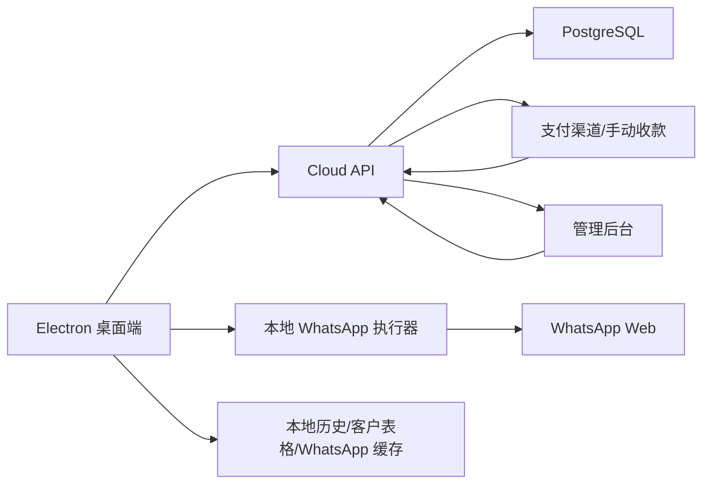

# WhatsApp 三语言号码解析与桌面软件计划

## Summary

本项目将现有 `main.js` Node 脚本升级为 Windows 图形桌面软件。用户导入 CSV/XLSX 表格后，软件自动识别电话列和国家列，解析不统一格式的电话号码，检测号码是否注册 WhatsApp，并按英语、西班牙语、法语三套模板发送首条问候消息。

当前脚本已有可复用基础：`whatsapp-web.js` 登录与发送逻辑、`.wwebjs_auth` 登录缓存、`.wwebjs_cache` 缓存目录和 `progress.json` 历史进度。新软件会尽量迁移复用登录状态和历史记录。

商业化版本会从“纯本地软件”演进为“本地执行 + 云端授权”的架构：WhatsApp 登录缓存、客户表格、任务执行和发送进度仍默认保留在用户电脑本地；云端只负责账号、套餐、额度账本、用量统计、支付订单、账单、推荐奖励和设备/工作台授权。这样既能做付费、限额和推荐记录，又不会把客户号码表格和 WhatsApp 登录态强行搬到服务器。

## Key Changes

- 使用 `Electron + Node + whatsapp-web.js` 封装为 Windows EXE 图形软件。
- 支持 CSV/XLSX 导入，自动识别 `电话`、`手机号`、`PhoneNumber`、`phone`、`mobile`、`tel` 等电话列。
- 支持自动识别 `收货国家`、`国家`、`country`、`Country`、`国家代码` 等国家列。
- 使用 `libphonenumber-js` 解析号码，兼容 `33781387438`、`33-771147488`、`337-340-6764`、`33 7 88 34 60 39`、`(256) 665-4606`、`44 7851 692353`、`49-17685664819` 等格式。
- 当电话没有国际区号时，使用国家列补齐区号。例如 国家=美国 且 电话=`(256) 665-4606`，解析为 `12566654606`。
- 当电话已有国际区号时，优先相信电话本身。例如 `33 7 88 34 60 39` 解析为法国号码 `33788346039`。
- 新增三语言模板池：英语 `en`、西班牙语 `es`、法语 `fr`。模板可在界面编辑，发送时随机选择。
- 语言识别顺序：表格语言列手动指定 > 国家/区号规则 > 默认英语。
- 每日限额和发送间隔可在界面设置，默认每日 80 个，默认 22-26 秒随机间隔。
- 结果记录成功、失败、未注册、跳过、格式无效、待确认，并支持导出 CSV/XLSX。

## Parsing Rules

- 清洗输入：去掉空格、横杠、括号、点号、引号、Excel 前导单引号，保留开头 `+`。
- 识别国际前缀：`+33...`、`0033...`、`33-...`、`33 7...` 都按国际号码解析。
- 使用国家列作为默认国家：美国/US/United States -> `US`，英国/UK/GB/United Kingdom -> `GB`，法国/FR/France -> `FR`，西班牙/ES/Spain -> `ES`，德国/DE/Germany -> `DE`。
- 输出 WhatsApp 需要的格式：E.164 去掉 `+` 后拼接 `@c.us`，例如 `+33788346039` -> `33788346039@c.us`。
- 无法确认国家、明显过短、明显过长、解析失败的号码标记为 `invalid` 或 `pending`，不会进入发送队列。
- 对 `337-340-6764` 这类歧义格式：如果国家列是法国则按法国解析；如果国家列是美国则按美国本地号码解析；没有国家列则进入待确认列表。

## Language Rules

- 英语模板：`+1` 美国/加拿大主流区号、`+44` 英国、`+61` 澳大利亚、`+64` 新西兰、`+353` 爱尔兰，以及主要英语官方国家。
- 西班牙语模板：`+34` 西班牙、`+52` 墨西哥、`+54` 阿根廷、`+56` 智利、`+57` 哥伦比亚、`+58` 委内瑞拉、`+51` 秘鲁、`+502` 到 `+507` 中美洲、`+591/+593/+595/+598` 等。
- 法语模板：`+33` 法国、`+32` 比利时、`+41` 瑞士、`+352` 卢森堡、`+377` 摩纳哥，以及主要法语官方国家和地区。
- `+1` 特殊处理：按后续三位区域码细分。波多黎各、多米尼加等走西语；加拿大法语重点区域走法语；其他默认英语。
- 非英语/西语/法语国家，如德国 `+49`，默认走英语模板，并在预检里显示“默认英语”。

## Desktop Workflow

1. 用户打开 Windows 桌面软件。
2. 用户导入 CSV/XLSX 文件。
3. 软件识别电话列、国家列和可选语言列。
4. 软件展示预检结果：总行数、有效号码、重复号码、无效号码、待确认号码、识别语言数量。
5. 用户确认模板、每日限额、发送间隔。
6. 软件弹出浏览器窗口，用户扫码登录 WhatsApp。
7. 软件按配置开始发送，支持暂停、继续、停止。
8. 任务完成或达到每日限额后，软件展示统计并允许导出报表。

## Implementation Plan

1. 初始化项目仓库，加入 `.gitignore`，保护登录缓存、客户号码和本地进度文件。
2. 将现有 `main.js` 拆成模块：号码解析、国家识别、语言识别、模板选择、任务执行、进度记录。
3. 新增 `phoneParser`，读取电话列和国家列，输出原始号码、标准号码、国家、语言、解析状态、错误原因。
4. 新增 `languageRules`，维护英语/西语/法语国家区号和 `+1` 区域码覆盖规则。
5. 创建 Electron 主进程和中文渲染界面，实现导入、预检、设置、模板管理、日志、统计、历史报表。
6. 发送任务只处理 `valid` 号码；`invalid` 和 `pending` 不发送，只写入报表。
7. 迁移旧 `progress.json` 为新历史记录，并保留备份。
8. 使用 `electron-builder` 打包 Windows EXE。

## Cloud Commercialization Architecture

### Goal

在不推翻现有 Electron 桌面执行架构的前提下，新增云端商业化底座，让软件可以可靠支持：

- 云端注册登录和多设备授权。
- 免费版、进阶版、专业版、商业版套餐。
- 按“成功添加”消耗额度，失败、未注册、号码无效、代理异常和暂停不扣额度。
- 每日/每月用量统计和套餐限额。
- 充值、订单、账单、退款和人工调整记录。
- 推荐码、推荐链接、被邀请注册、奖励发放和反作弊。
- 后台人工审核、补额度、封禁、改套餐和查看审计日志。

### Non-Goals

- 不把客户原始表格、完整号码名单、WhatsApp 登录缓存上传到云端。
- 不做绕过 WhatsApp 风控、验证码、封号限制或无限群发。
- 不承诺离线也能无限继续消耗付费额度；离线模式只允许查看本地历史和已缓存页面，不能开始新的扣费任务。
- 不把“每日上限”当成资产余额；每日上限只是风控阀门。

### High-Level Shape



桌面端仍是任务执行核心。服务器是“权威账本”和“授权中心”，不接管 WhatsApp 自动化本身。服务器不需要知道每个客户号码的明文，只需要接收每次成功添加后的幂等扣费请求和必要的统计维度。

## Product Rules

### Core Billing Rule

额度和每日限额必须分离：

- `balance_credits` 是用户付费资产，长期保留，不因为跨天清零。
- `daily_limit` 是套餐允许当天最多成功添加数量，每天按业务时区重置。
- `used_today` 是当天已经成功扣费的数量。
- `available_today = min(balance_credits, daily_limit - used_today)`。
- 任务只能在 `available_today > 0` 时继续处理下一个号码。

推荐默认业务时区使用 `Asia/Shanghai`，因为当前产品、界面和运营语境是中文。服务器必须统一按业务时区计算 `business_date`，不能相信桌面端本机时间。

### Plan Table

| 套餐 | 英文卡面 | 卡面 | 单价 | 每日上限 | 默认工作台 | 最低充值 | 适用人群 |
| --- | --- | --- | --- | --- | --- | --- | --- |
| 免费版 | FREE | 银卡 | 0 元 | 10 / 天 | 1 | 不可购买或只试用 | 测试/体验 |
| 进阶版 | PLUS | 金卡 | 0.3 元/成功添加 | 200 / 天 | 2 | 2000 额度 | 频繁业务沟通 |
| 专业版 | PRO | 金卡 | 0.2 元/成功添加 | 500 / 天 | 3 | 5000 额度 | 复杂且重度场景 |
| 商业版 | ULTRA | 金卡 | 0.1 元/成功添加 | 1000 / 天 | 5，可申请扩容 | 20000 额度 | 团队/高频业务 |

商业版不要在页面上写“无限工作台”。默认 5 个工作台更可控，超出后走人工审核扩容。

### Credit Consumption Rule

只在以下条件全部满足时扣 1 个添加额度：

1. 号码解析状态为 `valid`。
2. WhatsApp 检测结果为已注册。
3. 首条问候消息已经成功提交给 WhatsApp Web。
4. 本次发送没有被用户暂停、代理巡检拦截、浏览器崩溃或任务取消。
5. 桌面端向云端提交 `consume_credit` 请求，并带上幂等键。

以下情况不扣额度：

- 无效号码。
- 待确认号码。
- 重复号码跳过。
- 未注册 WhatsApp。
- 代理失败、代理出口 IP 变化、未登录、扫码过期。
- 发送前任务被暂停或停止。
- 发送失败且无法确认 WhatsApp 已接受消息。
- 云端扣费失败，桌面端必须把记录标记为 `billing_pending`，不能静默当作成功扣费。

### Daily Reset Rule

- 每日上限按服务器 `Asia/Shanghai` 的自然日重置。
- 重置的是 `usage_daily.used_count`，不是 `credit_ledger` 余额。
- 如果任务跨过 00:00，下一次请求服务器时自动进入新的 `business_date`。
- 任务运行中不要在桌面端自己倒计时清零；桌面端只显示服务器返回的 `reset_at`。
- 如果用户电脑时间错误，不影响真实上限。

### Balance Preservation Rule

- 已购买额度默认长期保留。
- 如果未来要做有效期，必须以单独的 `credit_lots.expires_at` 实现，不要直接修改总余额字段。
- 扣费优先消耗最早到期的额度包；没有有效期时按创建时间先进先出即可。
- 退款、拒付、人工扣减必须写负向账本，不允许直接改余额。

## Server Modules

### 1. Auth Module

职责：

- 云端用户注册、登录、退出、刷新 token。
- 密码哈希存储，推荐 `argon2id` 或 `bcrypt`，不要明文。
- 设备绑定和 session 管理。
- 支持未来邮箱/手机号验证，但 v1 可先用账号密码 + 管理员手动开通。

关键边界：

- 本地账号和云端账号要分开命名。当前本地账号可以保留为“本机资料档案”，云端账号才是付费主体。
- 桌面端启动后如果没有云端登录，只能使用免费试用或本地历史查看。
- token 过期时，任务不能继续新增扣费请求，必须暂停并提示重新登录。

### 2. Plan And Subscription Module

职责：

- 维护套餐目录。
- 记录用户当前套餐、套餐来源、开始/结束时间、状态。
- 返回桌面端可用权限：每日上限、工作台上限、模板数量、当前单价、最低充值额度。

关键边界：

- 桌面端展示可以缓存套餐目录，但真正限制以服务器返回为准。
- 降级套餐后，已购买额度不清零，只改变每日可消耗速度和功能权限。
- 套餐变更发生在任务运行中时，下一次 `entitlements` 或 `consume_credit` 请求要返回新限制。

### 3. Credit Ledger Module

职责：

- 记录所有额度变动。
- 计算当前余额。
- 支持充值入账、成功添加扣减、推荐奖励、退款扣回、管理员调整。
- 所有写入都要幂等。

账本类型：

- `purchase`: 用户充值入账。
- `consume`: 成功添加扣 1。
- `referral_reward`: 推荐奖励入账。
- `refund_reversal`: 退款或拒付扣回。
- `admin_adjustment`: 管理员人工调整。
- `migration_grant`: 老用户迁移赠送。

关键边界：

- 不允许直接更新余额后不写流水。
- 消耗额度要在数据库事务中同时检查余额、检查每日上限、写入账本、更新日/月用量。
- 同一个成功添加事件重复上报时，只能扣一次。

### 4. Usage Quota Module

职责：

- 维护日用量和月用量。
- 向用量页提供“本日使用情况”和“本月使用情况”。
- 给任务执行器返回可继续添加数量。

关键字段：

- `business_date`: 服务器业务日期。
- `business_month`: 服务器业务月份，例如 `2026-05`。
- `used_count`: 已成功扣费次数。
- `daily_limit_snapshot`: 当天第一次使用时的套餐上限快照。
- `plan_id_snapshot`: 当天使用时的套餐快照。

关键边界：

- 如果用户当天升级套餐，推荐立即使用新每日上限，`daily_limit_snapshot` 可更新为更高值。
- 如果用户当天降级套餐，不建议立即把当天上限降低到已经低于已用量的值；从下一天生效更少争议。
- 如果管理员临时给用户提额，记录为 `quota_override`，并写审计日志。

### 5. Payment And Orders Module

职责：

- 创建充值订单。
- 接收支付渠道回调。
- 支付成功后写 `purchase` 账本。
- 支持账单页展示付款记录、金额、额度、状态和发票/备注。

关键边界：

- 支付回调必须幂等，使用 `provider_event_id` 或订单号唯一约束。
- 支付成功但入账失败时，订单进入 `paid_pending_credit`，后台需要有补偿任务重试。
- 退款或拒付不删除原订单，新增 `refund` 记录和负向账本。
- 如果先做人工收款，可以把支付渠道抽象出来，后台手动把订单标记为 `paid` 后走同一套入账逻辑。

### 6. Referral Module

职责：

- 生成用户推荐码。
- 记录被邀请人注册来源。
- 判断奖励是否满足条件。
- 发放推荐奖励额度。

推荐 v1 规则：

- 被邀请人首次注册并完成首次有效充值后，邀请人获得固定额度奖励。
- 同设备、同 IP、同支付账户、同邮箱/手机号的明显自邀请不发奖励，进入 `held_for_review`。
- 奖励只发一次。
- 被邀请人退款或拒付后，奖励可以进入待扣回状态。

关键边界：

- 推荐奖励必须依赖服务器，否则本地软件无法可靠知道谁注册、谁充值、是否作弊。
- 推荐链接里的 `referral` 只作为归因线索，最终绑定以服务器注册接口写入为准。
- 本地页面上的推荐码和推荐记录都应该来自云端接口，不能只本地生成。

### 7. Device And Workspace License Module

职责：

- 管理每个云账号允许同时登录的设备。
- 管理当前在线工作台数量。
- 防止主工作台无限打开子工作台。

关键边界：

- 每个工作台启动时向云端申请 `workspace_lease`。
- `workspace_lease` 有过期时间，桌面端每 30-60 秒续租。
- 子工作台退出时主动释放租约。
- 如果进程崩溃，租约过期后自动释放。
- 如果离线，不能新开需要云端授权的工作台。

### 8. Admin And Audit Module

职责：

- 管理员查看用户、订单、额度流水、推荐记录、设备和工作台。
- 管理员可以人工调整套餐、补额度、冻结账号、释放异常工作台租约。
- 所有敏感操作写审计日志。

关键边界：

- 管理员不能直接改余额字段，只能写调整账本。
- 封禁用户后，桌面端下一次请求必须停止新的任务启动。
- 审计日志至少记录管理员、操作对象、操作前后摘要、时间、IP。

## Desktop Modules To Add Or Refactor

### Main Process Modules

- `src/main/cloudApiClient.js`
  - 封装 HTTPS 请求、token 刷新、超时、重试和错误标准化。
  - 不让 renderer 直接访问云端 token。

- `src/main/cloudAuthSession.js`
  - 保存云端登录态。
  - Windows 上优先用系统安全存储；如果暂时不用 keychain，至少加密落盘并绑定本机用户。

- `src/main/entitlementService.js`
  - 启动时拉取套餐、余额、今日可用、工作台上限。
  - 给任务引擎和 renderer 提供统一权限快照。

- `src/main/creditConsumeService.js`
  - 发送成功后提交扣费。
  - 生成幂等键。
  - 网络异常时把本地记录标记为 `billing_pending`，后台重试。

- `src/main/workspaceLeaseService.js`
  - 主工作台和子工作台启动时申请租约。
  - 定时续租。
  - 退出时释放。

- `src/main/billingSyncService.js`
  - 拉取订单、账单、额度流水、推荐记录。
  - 给探索方案页面提供数据。

### Renderer Pages

- 套餐页：
  - 展示服务器返回的套餐目录。
  - 当前套餐显示为 `FREE/PLUS/PRO/ULTRA`。
  - 升级按钮创建订单或提示联系人工。

- 用量页：
  - 显示今日已用、今日上限、今日剩余、重置时间。
  - 显示本月已用、成功添加明细、最近扣费事件。
  - 本地历史可以辅助展示，但权威统计来自云端。

- 额度页：
  - 显示账户余额、充值包、充值记录。
  - “购买额度”创建云端订单。
  - 额度规则明确写：成功添加才扣，失败不扣，未使用额度长期保留。

- 账单页：
  - 展示订单号、金额、额度、支付状态、付款时间、退款状态。
  - 支持复制订单号，后续可加发票/收据。

- 推荐奖励页：
  - 展示云端推荐码、推荐链接、邀请总数、已奖励额度。
  - 记录状态包含 `registered`、`paid`、`rewarded`、`held_for_review`、`reversed`。

## Database Design

推荐使用 PostgreSQL。额度、订单和推荐奖励都是钱相关数据，需要事务、唯一约束和审计能力，不建议用纯 JSON 文件或只靠桌面本地存。

### Core Tables

#### `users`

- `id`: UUID primary key.
- `email` or `username`: 唯一登录名。
- `password_hash`: 密码哈希。
- `status`: `active`, `frozen`, `deleted`.
- `created_at`, `updated_at`.
- `referred_by_user_id`: 可空，注册时绑定邀请人。

#### `sessions`

- `id`: UUID primary key.
- `user_id`.
- `refresh_token_hash`.
- `device_id`.
- `expires_at`.
- `revoked_at`.
- `created_at`.

#### `devices`

- `id`: UUID primary key.
- `user_id`.
- `device_fingerprint_hash`.
- `device_name`.
- `last_seen_at`.
- `status`.

#### `plans`

- `id`: `free`, `advanced`, `professional`, `business`.
- `display_name`: 中文名。
- `card_tier`: `FREE`, `PLUS`, `PRO`, `ULTRA`.
- `unit_price_cents`.
- `daily_limit`.
- `workspace_limit`.
- `minimum_top_up_credits`.
- `template_limit`.
- `status`.

#### `subscriptions`

- `id`: UUID primary key.
- `user_id`.
- `plan_id`.
- `status`: `active`, `past_due`, `cancelled`, `frozen`.
- `started_at`.
- `ends_at`.
- `changed_at`.

#### `credit_ledger`

- `id`: UUID primary key.
- `user_id`.
- `type`.
- `amount`: 正数入账，负数扣减。
- `balance_after`: 本次写入后的余额快照。
- `idempotency_key`: 唯一。
- `related_order_id`.
- `related_task_id`.
- `related_contact_hash`.
- `note`.
- `created_at`.

#### `usage_daily`

- `id`: UUID primary key.
- `user_id`.
- `business_date`.
- `plan_id_snapshot`.
- `daily_limit`.
- `used_count`.
- `created_at`, `updated_at`.
- 唯一约束：`user_id + business_date`。

#### `usage_monthly`

- `id`: UUID primary key.
- `user_id`.
- `business_month`.
- `plan_id_snapshot`.
- `used_count`.
- `created_at`, `updated_at`.
- 唯一约束：`user_id + business_month`。

#### `orders`

- `id`: UUID primary key.
- `order_no`: 可读订单号。
- `user_id`.
- `plan_id`.
- `credits`.
- `amount_cents`.
- `status`: `created`, `paid`, `paid_pending_credit`, `cancelled`, `refunded`, `chargeback`.
- `payment_provider`.
- `provider_trade_no`.
- `created_at`, `paid_at`, `closed_at`.

#### `payment_events`

- `id`: UUID primary key.
- `provider`.
- `provider_event_id`: 唯一。
- `order_id`.
- `event_type`.
- `payload_json`.
- `processed_at`.
- `created_at`.

#### `referral_codes`

- `id`: UUID primary key.
- `user_id`.
- `code`: 唯一，例如 `ADWA2026`。
- `status`.
- `created_at`.

#### `referral_records`

- `id`: UUID primary key.
- `referrer_user_id`.
- `referred_user_id`.
- `referral_code`.
- `status`: `registered`, `paid`, `rewarded`, `held_for_review`, `reversed`.
- `reward_credits`.
- `reward_ledger_id`.
- `first_paid_order_id`.
- `created_at`, `rewarded_at`.
- 唯一约束：`referred_user_id`，防止一个新用户绑定多个邀请人。

#### `workspace_leases`

- `id`: UUID primary key.
- `user_id`.
- `device_id`.
- `workspace_kind`: `primary`, `secondary`.
- `process_nonce`.
- `status`: `active`, `released`, `expired`.
- `expires_at`.
- `created_at`, `renewed_at`, `released_at`.

#### `admin_audit_logs`

- `id`: UUID primary key.
- `admin_user_id`.
- `target_type`.
- `target_id`.
- `action`.
- `before_json`.
- `after_json`.
- `ip`.
- `created_at`.

## API Contracts

### Auth

- `POST /v1/auth/register`
  - 输入：用户名/邮箱、密码、可选推荐码。
  - 输出：用户资料、access token、refresh token。
  - 异常：推荐码不存在时允许注册但不绑定；明显自邀请可绑定为待审核。

- `POST /v1/auth/login`
  - 输入：用户名/邮箱、密码、设备信息。
  - 输出：token 和当前用户摘要。

- `POST /v1/auth/refresh`
  - 输入：refresh token。
  - 输出：新 access token。

### Entitlements

- `GET /v1/me/entitlements`
  - 输出：当前套餐、余额、今日用量、今日剩余、月用量、工作台限制、推荐码。
  - 桌面端启动、任务开始、打开探索方案页面、工作台续租失败后都应刷新。

### Credits

- `POST /v1/credits/consume`
  - 输入：`idempotency_key`, `task_id`, `contact_hash`, `workspace_id`, `sent_at`。
  - 输出：新余额、今日已用、今日剩余。
  - 服务器事务内检查余额和每日上限。

- `GET /v1/credits/ledger`
  - 输出：额度流水分页。

### Usage

- `GET /v1/usage/summary?month=2026-05`
  - 输出：今日、本月、最近成功添加明细。

### Orders

- `POST /v1/orders`
  - 输入：套餐、额度包、支付方式。
  - 输出：订单号、金额、支付链接或人工收款说明。

- `GET /v1/orders`
  - 输出：订单和账单列表。

### Referrals

- `GET /v1/referrals/summary`
  - 输出：推荐码、推荐链接、邀请总数、奖励总额。

- `GET /v1/referrals/records`
  - 输出：被邀请账号、注册时间、充值状态、奖励状态。

### Workspace Leases

- `POST /v1/workspaces/leases`
  - 输入：设备、工作台类型、进程 nonce。
  - 输出：租约 ID、过期时间、当前占用。
  - 如果超过套餐限制，返回 `WORKSPACE_LIMIT_REACHED`。

- `POST /v1/workspaces/leases/:id/renew`
  - 输出：新过期时间。

- `POST /v1/workspaces/leases/:id/release`
  - 输出：释放结果。

## Task Billing Flow

### Before Starting A Task

1. 桌面端刷新 `/v1/me/entitlements`。
2. 如果用户未登录云端：
   - 免费体验可用时，按免费版限制。
   - 付费功能不可开始。
3. 如果余额为 0，禁止开始付费任务并跳到额度页。
4. 如果今日剩余为 0，禁止开始并显示下次重置时间。
5. 如果工作台租约异常，禁止开始并提示关闭多余工作台或重新登录。
6. 任务配置里的每日限额取 `min(用户输入, 套餐今日剩余, 本地风控上限)`。

### Per Contact

1. 本地解析号码。
2. 本地跳过无效、待确认、重复。
3. WhatsApp 检查是否注册。
4. 未注册写本地报表，不扣额度。
5. 已注册后发送首条消息。
6. 发送成功后调用 `/v1/credits/consume`。
7. 扣费成功后，本地记录状态为 `sent_billed`。
8. 扣费返回今日上限耗尽时，任务在当前号码后暂停。
9. 扣费网络失败时，本地记录为 `sent_billing_pending`，任务进入保守暂停，避免继续产生大量未结算成功发送。

### Idempotency Key

建议格式：

```text
consume:{cloud_user_id}:{local_task_id}:{normalized_phone_hash}:{template_language}:{first_sent_at_iso}
```

注意：

- `normalized_phone_hash` 使用 HMAC-SHA256，不上传明文号码。
- 同一个本地任务重试扣费时使用同一个幂等键。
- 如果用户重新导入同一名单重新跑，是否再次扣费由业务定义。默认“同一云账号 + 同一号码 + 同一任务”不重复扣；新任务重新发送成功可以再次扣。

## Failure And Edge Case Handling

### 1. 用户充值 2000 额度但当天用不完

处理：

- 余额保留在 `credit_ledger`。
- 当天最多扣到套餐每日上限。
- 第二天服务器 `business_date` 改变后，今日已用自然变成 0，余额继续可用。

用户界面文案：

- “未使用额度长期保留，只有成功添加才扣除。”
- “每日上限每天 00:00 按服务器时间重置，不影响账户余额。”

### 2. 任务运行到 23:59 跨过 00:00

处理：

- 桌面端每次扣费都以服务器返回的今日统计为准。
- 跨天后下一次扣费自动写入新 `usage_daily`。
- 页面上的今日已用和剩余在下一次刷新时更新。

### 3. 桌面端断网但 WhatsApp 已发送成功

处理：

- 本地记录为 `sent_billing_pending`。
- 暂停继续发送，避免产生更多未结算事件。
- 网络恢复后用同一幂等键补扣。
- 如果补扣失败原因是余额不足，任务停住并提示充值；该条记录保留为待处理，后台可人工审核。

### 4. 服务器扣费成功但桌面端崩溃

处理：

- 云端账本已经写入。
- 桌面端重启后读取本地任务记录，如果该条仍是未知状态，可用幂等键查询或再次提交扣费。
- 服务器因幂等键返回同一次扣费结果，不重复扣。

### 5. 用户同时开多个工作台抢额度

处理：

- 所有扣费在服务器事务里执行。
- `credit_ledger` 写入和 `usage_daily` 更新必须加行级锁或使用可串行化事务。
- 余额不足或今日上限不足时，后到请求失败。

### 6. 用户电脑时间不准

处理：

- 重置时间、今日统计、订单时间以服务器时间为准。
- 桌面端只显示服务器返回值。
- 本地任务日志可以记录本机时间，但报表里标注为“本机记录时间”。

### 7. 支付成功但没有到账

处理：

- 订单状态进入 `paid_pending_credit`。
- 后台补偿任务定期查找该状态并重试写 `purchase` 账本。
- 管理后台显示红色告警，允许管理员一键补入账。

### 8. 支付渠道重复回调

处理：

- `payment_events.provider_event_id` 唯一。
- `credit_ledger.idempotency_key` 唯一。
- 重复回调只返回已处理，不重复入账。

### 9. 退款和拒付

处理：

- 订单改为 `refunded` 或 `chargeback`。
- 写 `refund_reversal` 负向账本。
- 如果余额不足以扣回，用户账号进入 `past_due` 或 `frozen`，禁止开始新任务。

### 10. 推荐码自邀请和刷奖励

处理：

- 同设备指纹、同 IP、同支付账户、同邮箱/手机号、短时间批量注册进入 `held_for_review`。
- 奖励在被邀请人首次有效充值后发放，不在注册瞬间发放。
- 奖励发放也写 `credit_ledger`，并使用唯一幂等键 `referral_reward:{referral_record_id}`。

### 11. 用户降级套餐

处理：

- 已有余额不清零。
- 工作台上限下降后，不强杀已运行工作台；新开或续租时按新限制执行。
- 当天每日上限建议不立即降低到小于已用量，从下一业务日生效，减少争议。

### 12. 用户升级套餐

处理：

- 支付成功后立即更新订阅。
- 今日上限可立即提升。
- 单价按“成功添加发生时的当前套餐”计算，不回溯调整历史扣费。

### 13. 云端服务临时不可用

处理：

- 已登录用户可以查看本地历史、模板、设置。
- 不允许开始新的付费任务。
- 正在运行的任务在下一次需要扣费或续租时暂停。
- 页面显示“云端授权不可用，已暂停新的扣费动作”。

### 14. 管理员误操作

处理：

- 任何管理员改套餐、补额度、冻结账号都写 `admin_audit_logs`。
- 余额相关误操作只能通过反向账本修正，不删除原流水。
- 后台提供最近 30 天调整记录，方便追溯。

## Migration Strategy

### Phase A: Server Skeleton

目标：先让云端成为账号、套餐和额度账本的权威来源。

任务：

1. 新建服务端项目和 PostgreSQL。
2. 建立 `users`, `plans`, `subscriptions`, `credit_ledger`, `usage_daily`, `usage_monthly`。
3. 实现注册、登录、套餐查询、额度查询。
4. 给当前桌面端接入云端登录和权益读取。

验收：

- 用户登录后，探索方案页面显示云端套餐和余额。
- 未登录时，桌面端显示免费/本地模式提示。

### Phase B: Successful Add Billing

目标：成功添加才扣额度，失败不扣。

任务：

1. 实现 `/v1/credits/consume`。
2. 桌面端任务引擎在发送成功后调用扣费接口。
3. 本地历史增加 `billing_status`。
4. 用量页显示今日和本月用量。

验收：

- 成功发送扣 1。
- 未注册、失败、无效号码不扣。
- 重复提交同一幂等键不重复扣。

### Phase C: Payment Or Manual Top-Up

目标：用户可以购买额度，账单页可追踪。

任务：

1. 建立 `orders` 和 `payment_events`。
2. 先支持后台人工标记订单已支付。
3. 后续再接微信/支付宝/Stripe 等真实渠道。
4. 额度页购买按钮创建订单。

验收：

- 订单支付成功后写入 `purchase` 账本。
- 重复回调不重复入账。
- 账单页能看到订单状态。

### Phase D: Workspace Leases

目标：工作台数量从本地内存限制升级为云端租约。

任务：

1. 建立 `devices` 和 `workspace_leases`。
2. 主工作台启动申请主租约。
3. 子工作台打开申请子租约。
4. 每 30-60 秒续租，退出释放。

验收：

- 同一账号超过套餐工作台限制时无法继续打开。
- 崩溃后的租约会自动过期释放。

### Phase E: Referral Rewards

目标：推荐奖励有真实注册、充值和奖励记录。

任务：

1. 建立 `referral_codes` 和 `referral_records`。
2. 注册接口支持推荐码绑定。
3. 首次有效充值后发放奖励。
4. 推荐奖励页展示云端记录。
5. 增加自邀请/刷奖励待审核规则。

验收：

- 推荐链接注册能绑定邀请人。
- 被邀请人首次充值后邀请人获得奖励额度。
- 同设备/明显自邀请进入待审核，不自动发奖励。

## Implementation Task Breakdown

### Task 1: Extract Cloud-Aware Entitlement Contract

文件：

- 修改 `src/core/billingPlans.js`
- 新建 `src/core/entitlementContract.js`
- 新建 `tests/entitlementContract.test.js`

内容：

- 定义桌面端和云端共享的权益字段。
- 当前本地预览数据继续可用，但字段命名要接近云端返回。
- 测试 `available_today = min(balance, daily_limit - used_today)`。

验证：

- `npm test`

### Task 2: Add Cloud API Client Skeleton

文件：

- 新建 `src/main/cloudApiClient.js`
- 修改 `src/main/preload.js`
- 修改 `src/main/main.js`
- 新建 `tests/cloudApiClient.test.js`

内容：

- 封装 base URL、token、超时、错误码。
- 先用 mock/local preview 模式返回当前本地套餐数据。
- 未来替换真实 URL 时 renderer 不需要重写。

验证：

- `node --check src\main\cloudApiClient.js`
- `npm test`

### Task 3: Add Billing Status To Task History

文件：

- 修改任务执行器模块。
- 修改历史记录存储模块。
- 修改历史报表 renderer。
- 新建或扩展任务测试。

内容：

- 每条成功发送记录增加 `billing_status`: `not_required`, `pending`, `billed`, `failed`。
- 失败、未注册、无效号码明确记录 `billing_status = not_required`。
- 云端扣费失败时保存 `pending`。

验证：

- 成功发送但扣费失败时任务暂停。
- 重启后能看到待结算记录。

### Task 4: Wire Usage And Credits Pages To Entitlement Service

文件：

- 修改 `src/renderer/renderer.js`
- 修改 `src/renderer/index.html`
- 修改 `src/renderer/styles.css`

内容：

- 用量、额度、账单、推荐奖励页面全部从同一个权益/账单数据源渲染。
- 当前没有真实服务器时显示“本地预览数据”标识。
- 接入服务器后只替换数据来源，不重写页面结构。

验证：

- 打开 EXE，探索方案页面信息一致。
- 套餐切换 mock 数据后，页面同步更新。

### Task 5: Server Project Bootstrap

文件：

- 新建 `server/package.json`
- 新建 `server/src/app.js`
- 新建 `server/src/modules/auth/*`
- 新建 `server/src/modules/billing/*`
- 新建 `server/src/modules/usage/*`
- 新建 `server/src/modules/referrals/*`
- 新建 `server/src/db/schema.sql` 或迁移文件。

内容：

- 推荐 Node.js + Fastify + PostgreSQL。
- 如果后续想更强类型和迁移体验，可加 Prisma 或 Drizzle；v1 也可以先用 SQL migration 保持简单。
- API 先实现 auth、entitlements、credits consume。

验证：

- 服务端单测覆盖注册、查询权益、幂等扣费、余额不足、每日上限。

### Task 6: Payment And Referral Deferred Integration

文件：

- 服务端订单模块。
- 服务端推荐模块。
- 桌面账单页和推荐奖励页。

内容：

- 先做人工订单和推荐记录。
- 真实支付渠道后接入 `payment_events`。
- 推荐奖励最后做，因为它依赖用户注册、订单和账本都稳定。

验证：

- 人工标记订单成功后入账。
- 被邀请人首次有效充值后奖励只发一次。

## Test Plan

- 法国号码：`33781387438`、`33-771147488`、`33 7 88 34 60 39` 应识别为法语。
- 美国号码：`(256) 665-4606` + 国家=美国 应解析为 `12566654606`，语言为英语。
- 英国号码：`44 7851 692353`、`44-0746 8562 947` 应识别为英语，并处理本地前导 0。
- 德国号码：`49-17685664819` 应解析为德国号码，语言默认英语。
- 歧义号码：`337-340-6764` 在国家=法国、国家=美国、国家为空时分别验证不同解析结果。
- 表格导入：覆盖中文表头、英文表头、无表头、CSV、XLSX、空行、混合空格和特殊符号。
- 任务控制：暂停继续、达到每日上限、关闭后续跑、不重复发送。
- WhatsApp：扫码登录、复用登录、未注册跳过、发送失败写入报表。
- 报表：导出 CSV/XLSX 后统计数量与明细一致。

## Assumptions

- v1 只发送文字问候，不发送图片或附件。
- 默认语言可由软件自动判断，但用户可以在界面或表格中覆盖。
- “添加电话号码”在本项目中定义为验证号码并发送首条 WhatsApp 问候，不写入手机通讯录。
- 软件默认用于已有授权客户或已有业务关系联系人跟进。
- 不实现绕过 WhatsApp 风控、验证码、封号限制或无限群发功能。
